# Call Center Exploration Agents

Natural language query system for call center data using **OpenAI Agents SDK** with full observability via **Logfire**.

  

## Features

- 🤖 **Multi-Agent System**: SQL Agent + Evaluator Agent with handoffs
- 💬 **Chat Interface**: Up to 5 follow-up questions per session
- 📊 **Full Observability**: Logfire integration tracks every SQL query and agent interaction
- 🔒 **SQL Injection Protection**: Whitelist validation, read-only queries, keyword blocking
- 🕐 **Smart Date Context**: Understands "last month", "recent calls", relative dates
- 🎯 **Concise Responses**: Direct answers, not verbose evaluations

## Architecture

```mermaid
graph TB
    User[User] -->|Natural Language| UI[Chat UI]
    UI -->|POST /query| API[FastAPI App]
    API -->|session_id + question| Session[(SQLite Session)]
    
    API --> SQLAgent[SQL Search Agent<br/>gpt-5]
    SQLAgent -->|use tool| SQLTool[run_sql_query]
    SQLTool -->|validate| Validator{SQL Validator}
    Validator -->|✓ safe| DB[(Call Logs DB)]
    Validator -->|✗ unsafe| Error[Blocked]
    
    DB -->|results| SQLAgent
    SQLAgent -->|output| Evaluator[Result Evaluator<br/>gpt-5]
    Evaluator -->|good| Response[Concise Answer]
    Evaluator -->|needs fix| SQLAgent
    
    Response --> API
    API --> UI
    
    SQLTool -.->|logs| Logfire[Logfire Dashboard]
    SQLAgent -.->|traces| Logfire
    Evaluator -.->|traces| Logfire
    
    style SQLAgent fill:#6366f1,color:#fff
    style Evaluator fill:#a855f7,color:#fff
    style Logfire fill:#f59e0b,color:#000
```



## Project Structure

```
.
├── app.py                  # FastAPI server with Logfire
├── main.py                 # CLI interface
├── src/
│   ├── agents/
│   │   └── definitions.py  # SQL Agent, Evaluator Agent
│   ├── tools/
│   │   └── sql_tools.py    # run_sql_query with validation + logging
│   └── utils/
│       └── database.py     # Schema extraction, SQL execution
├── static/
│   └── index.html          # Chat UI (You ↔ Explorer)
├── database/
│   └── call_logs_october_1209.db  # Sample SQLite database
├── tests/
│   └── test_agents.py      # Standalone tests
└── sessions/               # SQLite session storage (gitignored)
```

## Quick Start

### 1. Prerequisites

- Python 3.12+
- [uv](https://github.com/astral-sh/uv) package manager

### 2. Install Dependencies

```bash
uv sync
```

### 3. Configure Environment

Create `.env`:
```bash
OPENAI_API_KEY=sk-...
LOGFIRE_TOKEN=pylf_v1_us_...
```

### 4. Run the App

```bash
# FastAPI server (recommended)
uv run uvicorn app:app --host 0.0.0.0 --port 8000 --reload

# Or CLI interface
uv run python main.py
```

### 5. Open UI

Navigate to: **http://localhost:8000/ui**

## Example Queries

- "How many calls did Theresa make in August?"
- "What's the average call duration for VIP customers?"
- "Top 5 employees by call count"
- "List transferred calls from Sales"
- "Show complaints from last month"
- "Recent calls (last 10 days)"

## Agent Workflow

### SQL Search Agent
- Generates SQL queries from natural language
- Has full database schema context
- Knows current date, business day defaults
- Executes via `run_sql_query` tool

### Result Evaluator
- Checks if results answer the question
- Hands back to SQL agent if refinement needed
- Returns **concise** answers (not verbose analysis)

### Session Management
- Conversations stored in SQLite (`sessions/`)
- Up to 5 turns before reset
- Follow-up questions work automatically

## SQL Security

All queries are validated:
- ✅ Only `SELECT` allowed
- ✅ Blocked keywords: `INSERT`, `UPDATE`, `DROP`, etc.
- ✅ Table/column whitelist validation
- ✅ Single statement enforcement
- ✅ No comments or multiple queries

## Logfire Observability

Every interaction is traced:
- SQL query generation
- Validation status
- Database execution (row count, columns)
- Agent handoffs
- Response formatting

**Dashboard**: https://logfire-us.pydantic.dev/pari2798/agentic-callcenter

## Database Schema

**Tables:**
- `employees` - Call center staff
- `customers` - Customer records
- `call_types` - Call categories (Support, Sales, Complaint, Billing, etc.)
- `calls` - 50,005 call records

**Sample Query:**
```sql
SELECT e.full_name, COUNT(*) as call_count
FROM calls c
JOIN employees e ON c.employee_id = e.employee_id
GROUP BY e.employee_id
ORDER BY call_count DESC
LIMIT 5;
```

## Development

### Run Tests

```bash
uv run python tests/test_agents.py
```

Tests cover:
- Database utilities
- SQL validation
- Tool functionality
- Agent interactions (requires API key)

### Project Dependencies

Core:
- `openai-agents` - Multi-agent framework
- `logfire[fastapi]` - Observability
- `fastapi` - Web framework
- `python-dotenv` - Environment management

## API Endpoints

| Endpoint | Method | Description |
|----------|--------|-------------|
| `/ui` | GET | Chat interface |
| `/query` | POST | Execute query with session |
| `/examples` | GET | Example questions |
| `/health` | GET | Health check |
| `/docs` | GET | Swagger UI |

## Configuration

### Date Context

Agent has built-in awareness:
- `Today's date`: 2024-12-16
- `Last 10 business days`: Auto-calculated
- Handles "last month", "this year", etc.

### Chat Limits

- Max 5 turns per session
- Auto-reset prompt after limit
- New Chat button available

## Troubleshooting

**"No module named 'agents'"**
```bash
uv add openai-agents
```

**"Logfire auth required"**
```bash
uv run logfire auth
```

**Session errors**
```bash
rm -rf sessions/*.db
```

## License

MIT

## Author

Built with OpenAI Agents SDK + Logfire
